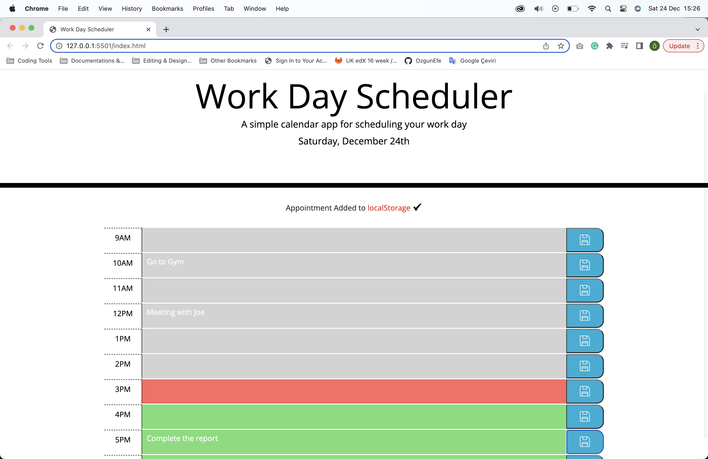

# Daily-Planner-App
I created a simple calendar application that allows a user to save events for each hour of the day.

## Daily-Planner Logic
- It displays the current day at the top of the calendar when a user opens the planner.
- It shows a colour background for each time block based on past (grey), present(red), and future(green) when the time block is viewed.
- It allows a user to enter an event when they click a time block.
- It saves the event in local storage when the save button is clicked in that time block.

### Live Link
https://ozgunefe.github.io/Daily-Planner-App/

## Screenshots
### App

### Notification and Tasks

